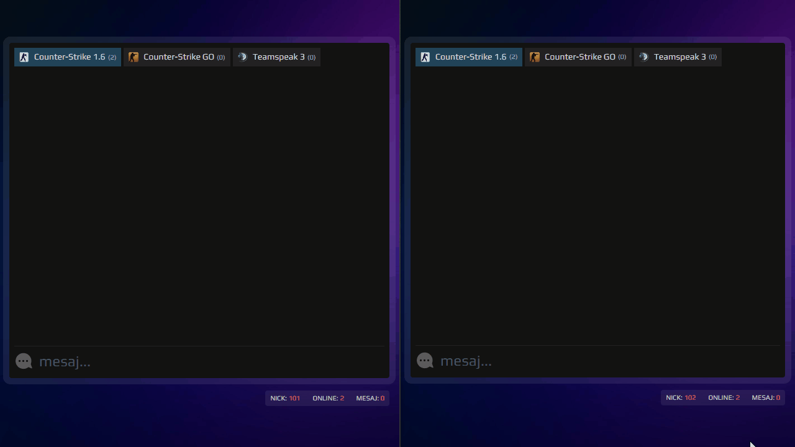

# Anonymous Chat | Next.js
🥷 This project allows you to chat anonymously as soon as you enter the site.

🚀 When you enter the site, an ID (number) is assigned to each user (per IP address) and you can start chatting directly.

🤯 Moreover, in the messages area, you can start a private chat by clicking on the ID (number) of the users who wrote the message 

📜 This project is inspired by the [5e5](https://5e5.org) website, which is a product of the [Prooyun](https://prooyun.net) company.

## Demo

  
   

## Instructions
1. Clone locally using `git clone git@github.com:CanKorkmazim/anon-chat.git`
2. Install dependencies using `npm install`
3. Check `config.ts and edit it as it suits you.
4. Start Next.js with development mode using `npm run dev`
5. Start socket server with development mode using `npm run devSocket`
6. Open [localhost:9001](https://localhost:9001)

## Features
- Does not require membership
- ID (number) is defined to the IP address
- Can chat in public rooms
- When you are in one room and receive a message from another room, the tab's background turns red.
- By clicking on a person, they can chat privately. (if person is online)
- Play a notification sound when you receive a private message
- The number of messages per room (including private chats) is limited to 100 to prevent RAM memory from becoming bloated.

## Tech stacks
- Next.js
- Socket.IO
- Tailwind
- Shadcn/ui

By [Can Korkmaz](https://github.com/CanKorkmazim)